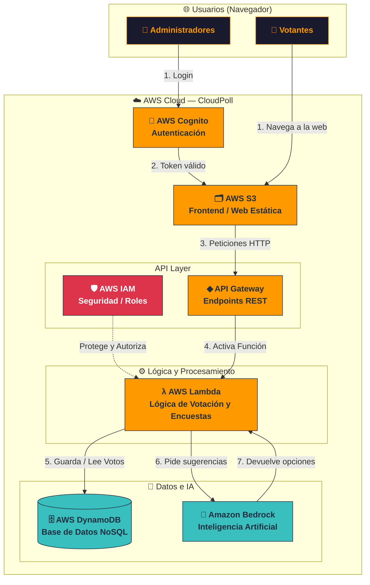

# Arquitectura - CloudPoll

Diagrama de arquitectura de la plataforma de encuestas serverless **CloudPoll**, basado en servicios de AWS.

---

## Descripción del flujo

| Paso | Actor / Servicio | Acción |
|---|---|---|
| 1a | **Admin → Cognito** | El administrador inicia sesión. Cognito valida credenciales y emite un token JWT. |
| 1b | **Votante → S3** | El votante navega directamente al frontend estático en S3 sin autenticación. |
| 2 | **Cognito → S3** | Token JWT válido; el admin es redirigido al frontend con el token en memoria. |
| 3 | **S3 → API Gateway** | El frontend envía peticiones HTTP (con o sin JWT según la ruta). |
| 4 | **API Gateway → Lambda** | API Gateway valida el JWT en rutas protegidas y activa la función Lambda correspondiente. |
| 5 | **Lambda ↔ DynamoDB** | Lambda lee y escribe votos y encuestas en DynamoDB. |
| 6 | **Lambda → Bedrock** | Para sugerencias de preguntas, Lambda invoca Amazon Bedrock con el tema indicado. |
| 7 | **Bedrock → Lambda** | Bedrock devuelve las preguntas y opciones generadas; Lambda las retorna al cliente. |

---

## Endpoints y autenticación

| Método | Ruta | Auth | Lambda |
|---|---|---|---|
| `POST` | `/polls` | ✅ JWT (Cognito) | `create-poll` |
| `POST` | `/votes` | ❌ Pública | `vote` |
| `GET` | `/results/{pollId}` | ❌ Pública | `results` |
| `POST` | `/suggest` | ✅ JWT (Cognito) | `suggest-questions` |
