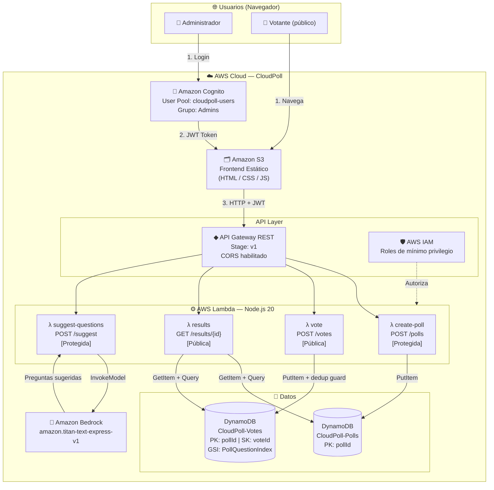

```mermaid
flowchart TD
    subgraph Usuarios["🌐 Usuarios (Navegador)"]
        Admin["👤 Administrador"]
        Voter["👥 Votante (público)"]
    end

    subgraph AWS["☁️ AWS Cloud — CloudPoll"]
        Cognito["🔐 Amazon Cognito\nUser Pool: cloudpoll-users\nGrupo: Admins"]
        S3["🗂️ Amazon S3\nFrontend Estático\n(HTML / CSS / JS)"]

        subgraph API["API Layer"]
            APIGW["◆ API Gateway REST\nStage: v1\nCORS habilitado"]
            IAM["🛡️ AWS IAM\nRoles de mínimo privilegio"]
        end

        subgraph Lambdas["⚙️ AWS Lambda — Node.js 20"]
            L1["λ create-poll\nPOST /polls\n[Protegida]"]
            L2["λ vote\nPOST /votes\n[Pública]"]
            L3["λ results\nGET /results/{id}\n[Pública]"]
            L4["λ suggest-questions\nPOST /suggest\n[Protegida]"]
        end

        subgraph Data["💾 Datos"]
            Polls[("DynamoDB\nCloudPoll-Polls\nPK: pollId")]
            Votes[("DynamoDB\nCloudPoll-Votes\nPK: pollId | SK: voteId\nGSI: PollQuestionIndex")]
        end

        Bedrock["🤖 Amazon Bedrock\namazon.titan-text-express-v1"]
    end

    Admin      -- "1. Login"               --> Cognito
    Cognito    -- "2. JWT Token"           --> S3
    Voter      -- "1. Navega"              --> S3

    S3         -- "3. HTTP + JWT"          --> APIGW
    IAM        -. "Autoriza"              .-> Lambdas

    APIGW      --> L1 & L2 & L3 & L4

    L1         -- "PutItem"               --> Polls
    L2         -- "PutItem + dedup guard" --> Votes
    L3         -- "GetItem + Query"       --> Polls & Votes
    L4         -- "InvokeModel"           --> Bedrock
    Bedrock    -- "Preguntas sugeridas"   --> L4
```
