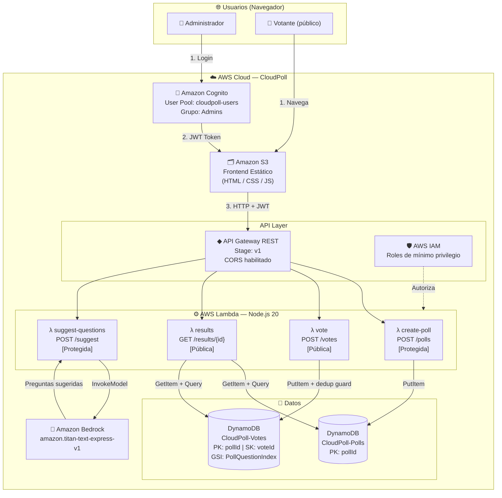

# CloudPoll — Presentación 2
## Arquitectura Detallada + Avance Real

---

## 1. Arquitectura Detallada

### 1.1 Diagrama de flujo de datos



---

### 1.2 Flujo de datos por caso de uso

#### Caso 1 — Votante emite un voto

```
Navegador
  │
  ├─ POST /v1/votes  ──────────────────────────────────────────────────────┐
  │   Body: { pollId, questionId, optionId }                               │
  │                                                                        ▼
  │                                                              API Gateway (sin auth)
  │                                                                        │
  │                                                              Lambda: vote
  │                                                                        │
  │                                                    ┌───────────────────┤
  │                                               ¿Existe DUP#<ip>#<pollId>?
  │                                            SÍ ─► 409 "Ya votaste"    │ NO
  │                                                                        │
  │                                              PutItem(voto) + PutItem(guard)
  │                                                                        │
  └──────────────────── 201 { voteId, timestamp } ────────────────────────┘
```

#### Caso 2 — Admin crea una encuesta

```
Navegador
  │
  ├─ POST /v1/polls  ─────────────────────────────────────────────────────┐
  │   Header: Authorization: Bearer <JWT>                                 │
  │   Body: { title, description, questions[] }                           │
  │                                                                       ▼
  │                                                    API Gateway + Cognito Authorizer
  │                                                      │ JWT inválido ─► 401
  │                                                      │ JWT válido
  │                                                                       │
  │                                                         Lambda: create-poll
  │                                                              │
  │                                               Valida campos + genera UUID
  │                                                              │
  │                                              PutItem(encuesta en CloudPoll-Polls)
  │                                                              │
  └────────── 201 { pollId, createdAt } ─────────────────────────────────┘
```

#### Caso 3 — Consulta de resultados

```
Navegador / Votante
  │
  ├─ GET /v1/results/{pollId} ────────────────────────────────────────────┐
  │                                                                       │
  │                                                    API Gateway (sin auth)
  │                                                                       │
  │                                                       Lambda: results
  │                                                              │
  │                                           GetItem(poll) desde CloudPoll-Polls
  │                                                              │
  │                                     Query(votos) desde CloudPoll-Votes (paginado)
  │                                                              │
  │                                      Agrega conteos y calcula porcentajes
  │                                                              │
  └──── 200 { title, results: [{ questionId, options: [{ count, % }] }] } ┘
```

---

### 1.3 Integraciones entre servicios

| Origen | Destino | Protocolo | Datos transmitidos |
|---|---|---|---|
| S3 (frontend) | Cognito | HTTPS redirect | Código de autorización OAuth |
| Cognito | Frontend | HTTPS | JWT (id_token, access_token) |
| Frontend | API Gateway | HTTPS REST | JSON + Bearer Token |
| API Gateway | Cognito | Interno AWS | Validación JWT |
| API Gateway | Lambda | Invocación | Evento JSON (path, headers, body) |
| Lambda | DynamoDB | AWS SDK v3 | JSON (PutItem, GetItem, Query) |
| Lambda | Bedrock | AWS SDK v3 | Prompt texto → JSON sugerencias |
| Lambda | IAM | Implícito | Assume role con permisos mínimos |

---

## 2. Decisiones Técnicas

### 2.1 Serverless vs Arquitectura Tradicional

| Criterio | Serverless (CloudPoll) | Tradicional (EC2 + RDS) |
|---|---|---|
| **Escalabilidad** | Automática e instantánea | Manual o con Auto Scaling Groups |
| **Disponibilidad** | SLA AWS Lambda: 99.95% | Depende de configuración |
| **Costo en reposo** | $0 (sin tráfico = sin cobro) | ~$15-50/mes mínimo por instancia activa |
| **Costo en pico** | Proporcional al tráfico real | Capacidad reservada pagada siempre |
| **Despliegue** | `sam deploy` (< 5 min) | Configuración manual de servidores |
| **Mantenimiento** | AWS gestiona SO, parches, HW | Equipo gestiona infraestructura |
| **Cold start** | 100–500 ms primer invocación | Sin cold start (siempre activo) |
| **Límite de ejecución** | 15 min por invocación | Sin límite |
| **Estado** | Sin estado (stateless) | Puede tener estado en memoria |

### ✅ ¿Por qué Serverless para CloudPoll?

1. **Patrón de tráfico impredecible** — Una encuesta viral puede recibir 0 votos durante horas y luego 10,000 en minutos. Lambda escala automáticamente sin intervención.

2. **MVP económico** — Sin costo fijo: la capa gratuita de AWS Lambda cubre 1 millón de invocaciones/mes. Ideal para validar el producto.

3. **Equipo pequeño** — Sin operaciones de infraestructura. El equipo se enfoca en lógica de negocio.

4. **DynamoDB complementa el modelo** — NoSQL sin servidores, `PAY_PER_REQUEST`, replica multi-AZ automáticamente.

5. **Cognito elimina el backend de auth** — Gestión de usuarios, tokens JWT, MFA, sin código propio.

### ⚠️ Trade-offs aceptados

- **Cold start**: Mitigable con Provisioned Concurrency en producción.
- **Vendor lock-in con AWS**: Aceptable para MVP; el código Node.js es portable.
- **Sin WebSockets nativos**: Para resultados en tiempo real se puede usar API Gateway WebSocket o polling desde el frontend.

---

## 3. Avance Funcional

### 3.1 Servicios implementados

| # | Servicio AWS | Estado | Evidencia |
|---|---|---|---|
| 1 | **DynamoDB Local** | ✅ Corriendo | Tablas creadas, datos insertados |
| 2 | **Lambda `results`** | ✅ Funcional | Responde con agregados y porcentajes |
| 3 | **Lambda `vote`** | ✅ Funcional | Registra votos, bloquea duplicados |
| 4 | **Lambda `create-poll`** | ✅ Funcional | Crea encuesta con UUID |
| 5 | **Lambda `suggest-questions`** | ✅ Implementada | Pendiente cuenta Bedrock |
| 6 | **API Gateway (SAM local)** | ✅ Corriendo | 4 endpoints montados en :3000 |
| 7 | **GitHub Repository** | ✅ Publicado | https://github.com/Rdrgrvram/CloudPoll |

### 3.2 Estructura del repositorio (evidencia de código)

```
CloudPoll/
├── template.yml                    ← SAM IaC (DynamoDB + 4 Lambdas + IAM)
├── docker-compose.yml              ← DynamoDB Local
├── env.local.json                  ← Variables de entorno locales
├── scripts/
│   ├── setup-local.js              ← Crea tablas localmente
│   └── seed-local.js               ← Inserta datos de prueba
├── lambdas/
│   ├── create-poll/index.js        ← POST /polls  [Protegida]
│   ├── vote/index.js               ← POST /votes  [Pública]
│   ├── results/index.js            ← GET /results/{pollId} [Pública]
│   └── suggest-questions/index.js  ← POST /suggest [Protegida, Bedrock]
└── docs/
    ├── architecture.md             ← Diagrama Mermaid
    ├── TechStack.md
    ├── Components.md
    ├── Requisitos.md
    └── implementation-guide.md
```

### 3.3 Endpoints disponibles

```bash
# Entorno local: sam local start-api --env-vars env.local.json

# ── PÚBLICO ────────────────────────────────────────────────
# Votar
POST http://localhost:3000/votes
Content-Type: application/json
{
  "pollId": "poll-test-001",
  "questionId": "q1",
  "optionId": "o1"
}
# → 201 { "message": "Voto registrado", "voteId": "...", "timestamp": "..." }
# → 409 si ya votó (mismo IP + pollId)

# Ver resultados
GET http://localhost:3000/results/poll-test-001
# → 200 { "title": "...", "results": [{ "totalVotes": 4, "options": [...] }] }

# ── PROTEGIDA (requiere JWT de Cognito) ────────────────────
# Crear encuesta
POST http://localhost:3000/polls
Authorization: Bearer <token>
Content-Type: application/json
{
  "title": "Encuesta de tecnología",
  "description": "¿Qué usas?",
  "questions": [
    {
      "questionId": "q1",
      "text": "¿Framework favorito?",
      "options": [
        { "optionId": "o1", "text": "Node.js" },
        { "optionId": "o2", "text": "Python" }
      ]
    }
  ]
}

# Sugerir preguntas con IA
POST http://localhost:3000/suggest
Authorization: Bearer <token>
Content-Type: application/json
{ "topic": "tecnología web", "numQuestions": 3 }
```

### 3.4 Datos de prueba insertados (seed)

**Tabla `CloudPoll-Polls`**
```json
{
  "pollId": "poll-test-001",
  "title": "Encuesta de tecnologías favoritas",
  "status": "active",
  "questions": [
    { "questionId": "q1", "text": "¿Framework de backend favorito?",
      "options": ["Node.js/Express", "Python/FastAPI", "Java/Spring", "Go/Gin"] },
    { "questionId": "q2", "text": "¿Qué base de datos usas más?",
      "options": ["PostgreSQL", "DynamoDB", "MongoDB", "MySQL"] }
  ]
}
```

**Tabla `CloudPoll-Votes`** — 7 votos pre-insertados

| voteId | questionId | optionId | voterIp |
|---|---|---|---|
| v001 | q1 | o1 (Node.js) | 10.0.0.1 |
| v002 | q1 | o1 (Node.js) | 10.0.0.2 |
| v003 | q1 | o2 (FastAPI) | 10.0.0.3 |
| v004 | q1 | o3 (Spring) | 10.0.0.4 |
| v005 | q2 | o2 (DynamoDB) | 10.0.0.1 |
| v006 | q2 | o1 (PostgreSQL) | 10.0.0.2 |
| v007 | q2 | o2 (DynamoDB) | 10.0.0.3 |

**Respuesta esperada `GET /results/poll-test-001`**
```json
{
  "pollId": "poll-test-001",
  "title": "Encuesta de tecnologías favoritas",
  "results": [
    {
      "questionId": "q1",
      "text": "¿Framework de backend favorito?",
      "totalVotes": 4,
      "options": [
        { "optionId": "o1", "text": "Node.js/Express", "count": 2, "percentage": 50 },
        { "optionId": "o2", "text": "Python/FastAPI",  "count": 1, "percentage": 25 },
        { "optionId": "o3", "text": "Java/Spring Boot","count": 1, "percentage": 25 },
        { "optionId": "o4", "text": "Go/Gin",          "count": 0, "percentage": 0  }
      ]
    },
    {
      "questionId": "q2",
      "text": "¿Qué base de datos usas más?",
      "totalVotes": 3,
      "options": [
        { "optionId": "o1", "text": "PostgreSQL", "count": 1, "percentage": 33 },
        { "optionId": "o2", "text": "DynamoDB",   "count": 2, "percentage": 67 },
        { "optionId": "o3", "text": "MongoDB",    "count": 0, "percentage": 0  },
        { "optionId": "o4", "text": "MySQL",      "count": 0, "percentage": 0  }
      ]
    }
  ]
}
```

### 3.5 Logs de SAM (evidencia de ejecución)

```
Mounting ResultsFunction at http://127.0.0.1:3000/results/{pollId} [GET]
Mounting VoteFunction at http://127.0.0.1:3000/votes [POST]
Mounting CreatePollFunction at http://127.0.0.1:3000/polls [POST]
Mounting SuggestQuestionsFunction at http://127.0.0.1:3000/suggest [POST]
Running on http://127.0.0.1:3000

START RequestId: ... Version: $LATEST
END RequestId: ...
REPORT Duration: 312 ms  Memory Size: 256 MB  Max Memory Used: 98 MB
```

---

## 4. Repositorio con Código

**URL:** https://github.com/Rdrgrvram/CloudPoll

**Rama principal:** `main`

**Commits relevantes:**
- `docs: arquitectura, requisitos, componentes, guía de implementación`
- `feat: template SAM completo con 4 Lambdas, DynamoDB, IAM`
- `feat: implementación de las 4 funciones Lambda (Node.js 20)`
- `feat: entorno local con DynamoDB Local + Docker + seed data`

---

## 5. Estimación de Costos (AWS Pricing Calculator)

> Escenario: **10,000 encuestas/mes**, **100,000 votos/mes**, **500 consultas de resultados/día**

### 5.1 AWS Lambda

| Parámetro | Valor |
|---|---|
| Invocaciones/mes | ~220,000 (votos + creación + resultados) |
| Duración promedio | 300 ms |
| Memoria | 256 MB |
| Capa gratuita | 1,000,000 invocaciones + 400,000 GB-s |
| **Costo estimado** | **$0.00 (dentro de la capa gratuita)** |

### 5.2 Amazon DynamoDB

| Parámetro | Valor |
|---|---|
| Modo de facturación | PAY_PER_REQUEST |
| Escrituras/mes | ~110,000 (votos + encuestas) |
| Lecturas/mes | ~215,000 (resultados + validaciones) |
| Almacenamiento estimado | < 1 GB |
| Capa gratuita | 25 GB + 2.5M lecturas + 1M escrituras/mes |
| **Costo estimado** | **$0.00 (dentro de la capa gratuita)** |

### 5.3 Amazon API Gateway

| Parámetro | Valor |
|---|---|
| Llamadas API/mes | ~220,000 |
| Capa gratuita | 1,000,000 llamadas/mes (12 meses) |
| **Costo estimado** | **$0.00 (dentro de la capa gratuita)** |

### 5.4 Amazon Cognito

| Parámetro | Valor |
|---|---|
| Usuarios activos mensuales (MAU) | ~10 admins |
| Capa gratuita | 50,000 MAU |
| **Costo estimado** | **$0.00** |

### 5.5 Amazon S3

| Parámetro | Valor |
|---|---|
| Almacenamiento frontend | < 10 MB |
| Peticiones GET/mes | ~15,000 |
| Capa gratuita | 5 GB + 20,000 GET/mes |
| **Costo estimado** | **$0.00** |

### 5.6 Amazon Bedrock

| Parámetro | Valor |
|---|---|
| Modelo | amazon.titan-text-express-v1 |
| Uso estimado | 200 consultas/mes (~1,000 tokens c/u) |
| Precio | $0.0002 por 1,000 tokens input |
| **Costo estimado** | **~$0.04/mes** |

### 5.7 Resumen de costos

| Servicio | Costo mensual (MVP) | Costo mensual (10x escala) |
|---|---|---|
| AWS Lambda | $0.00 | ~$1.20 |
| DynamoDB | $0.00 | ~$2.50 |
| API Gateway | $0.00 | ~$0.70 |
| Cognito | $0.00 | $0.00 |
| S3 | $0.00 | ~$0.05 |
| Bedrock | ~$0.04 | ~$0.40 |
| **TOTAL** | **~$0.04/mes** | **~$4.85/mes** |

> 💡 **Comparativa**: Una arquitectura tradicional equivalente (EC2 t3.small + RDS db.t3.micro) costaría ~**$35–60/mes** fijos, independientemente del tráfico.

---

## 6. Coherencia del Sistema

### ¿Ya funciona algo real?
✅ Sí. Las siguientes partes están operativas de forma integrada:
- DynamoDB Local corriendo en Docker con datos reales
- 3 Lambdas respondiendo peticiones HTTP vía SAM local
- Deduplicación de votos funcional (patrón guard item en DynamoDB)
- Agregación de resultados con porcentajes en tiempo real

### ¿Las decisiones están justificadas?
✅ Sí:
- Serverless elimina costos fijos y escala automáticamente ante picos (encuestas virales)
- DynamoDB NoSQL es ideal para escrituras de alta velocidad (votos concurrentes)
- Cognito elimina la necesidad de implementar auth desde cero
- API Gateway centraliza seguridad (JWT) y CORS

### ¿El sistema es coherente?
✅ Sí:
- Cada Lambda tiene un único propósito (SRP)
- IAM de mínimo privilegio: solo los permisos necesarios por función
- Rutas públicas vs protegidas claramente separadas en el template SAM
- El frontend estático (S3) está desacoplado del backend (Lambda)
