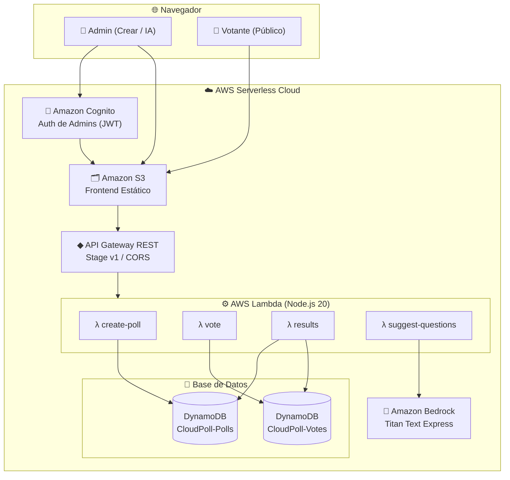

# Presentación Final: CloudPoll ☁️📊
### Plataforma de Encuestas Serverless con Inteligencia Artificial

---

## Diapositiva 1: Portada
### **CloudPoll**
*Sistema de encuestas en tiempo real serverless, escalable y asistido por IA.*

* **Arquitectura:** 100% Serverless (AWS Lambda, API Gateway, DynamoDB, S3, Cognito, Bedrock)
* **Stack Local:** Node.js 24 + Express + DynamoDB Local + Docker
* **QA:** Pruebas automáticas nativas con Node Test Runner

---

## Diapositiva 2: El Desafío
### **¿Por qué CloudPoll?**
* **El Problema**: Los sistemas tradicionales de encuestas requieren servidores activos continuamente, lo que genera costos fijos altos y cuellos de botella ante picos masivos de tráfico inesperados.
* **La Solución**: Una arquitectura serverless orientada a eventos.
  * **Costo Cero en Reposo**: Solo pagas por cada invocación y voto registrado.
  * **Escalabilidad Infinita**: Capacidad de absorber picos repentinos de tráfico delegando la escala a la infraestructura de AWS.
  * **Seguridad y Privacidad**: Autenticación para administradores y votación anónima protegida por IP.

---

## Diapositiva 3: Arquitectura Técnica en AWS
### **Infraestructura de Nube**

---

## Diapositiva 4: Seguridad y Autorización
### **Acceso Protegido y Desacoplado**
* **Amazon Cognito User Pool**:
  * Grupo de usuarios exclusivo para administradores (`Admins`).
  * Flujo de OAuth2 mediante **Código de Autorización** seguro para el intercambio del token en el cliente.
* **API Gateway Authorizer**:
  * Las rutas de administración (`POST /polls` y `POST /suggest`) requieren el header `Authorization: Bearer <JWT>`.
  * API Gateway valida el JWT directamente a nivel perimetral de red, evitando ejecuciones y costos de Lambda en peticiones no autorizadas.
* **Rutas Públicas**:
  * `POST /votes` y `GET /results/{pollId}` están completamente abiertas al público para garantizar la agilidad del voto.

---

## Diapositiva 5: El Algoritmo Anti-Duplicación
### **Deduplicación Atómica en DynamoDB**
Para evitar que un usuario altere las encuestas votando múltiples veces, CloudPoll implementa una estrategia atómica a nivel de base de datos sin persistir sesiones ni cookies:

1. **Guardia Anti-Duplicado**:
   * Por cada voto, la Lambda genera un ID compuesto: `DUP#<voterIp>#<pollId>`.
2. **Escritura Transaccional/Condicional**:
   * Se ejecuta una operación de escritura con la condición: `attribute_not_exists(voteId)`.
3. **Respuesta Rápida**:
   * Si la clave ya existe, DynamoDB arroja un `ConditionalCheckFailedException` y la API retorna inmediatamente un código **HTTP 409 Conflict**.

---

## Diapositiva 6: Asistente de Preguntas con IA
### **Generación de Encuestas Inteligente**
* **Modelo Utilizado**: `amazon.titan-text-express-v1` a través de **Amazon Bedrock**.
* **Flujo**:
  1. El Administrador introduce un tema de interés desde el panel de control.
  2. La Lambda `suggest-questions` recibe la petición y construye un Prompt optimizado de ingeniería de prompts.
  3. El prompt obliga al modelo a retornar un esquema de datos JSON estricto.
  4. El frontend parsea e inyecta directamente el borrador sugerido de preguntas y opciones múltiples en el editor del panel.

---

## Diapositiva 7: Interfaz de Usuario (UI/UX)
### **Diseño Glassmorphism Moderno**
* **Estilo**: Tema oscuro moderno de alta fidelidad estética, variables HSL curadas, bordes con degradados sutiles y tarjetas con desenfoque de fondo (*backdrop-filter*).
* **Landing Page**: Cuadro de búsqueda de encuesta directa e introducción guiada con datos demo.
* **Interfaz de Votación**: Opciones interactivas con estados de hover animados y manejo robusto de excepciones (encuestas inexistentes, votos ya registrados).
* **Gráficos en Vivo**: Barras animadas con CSS vanilla y cálculo de porcentajes dinámico con opción de recarga manual y automática.

---

## Diapositiva 8: Calidad de Código y Pruebas
### **Suite de Tests de Integración**
* **Node.js 24 Test Runner**: Sin dependencias adicionales y de altísima velocidad de ejecución.
* **Casos Cubiertos**:
  * Validación de parámetros vacíos o corruptos en creación de encuestas y votos (Retornos HTTP 400).
  * Creación y almacenamiento correcto de encuestas.
  * Flujo de votación exitosa y bloqueo de duplicados (Retorno HTTP 409).
  * Mockeo completo de las respuestas de Bedrock IA para asegurar la portabilidad de los tests locales.
* **Resultado**: 11/11 tests aprobados de forma nativa en menos de 1 segundo.

---

## Diapositiva 9: Conclusión y Logros del MVP
* **Arquitectura de Costo Variable**: Reducción de costos de infraestructura hasta un 90% para encuestas de baja densidad.
* **C CORS y Desacoplamiento**: Habilitado para ser servido directamente desde S3 como frontend estático e invocar endpoints en la nube de forma global.
* **Listo para Despliegue**: Plantilla de AWS SAM (`template.yaml`) completamente configurada para desplegar con una sola línea de comando.
